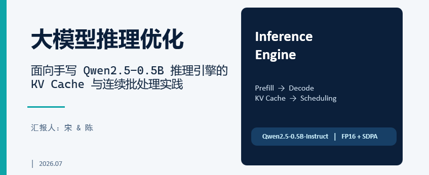
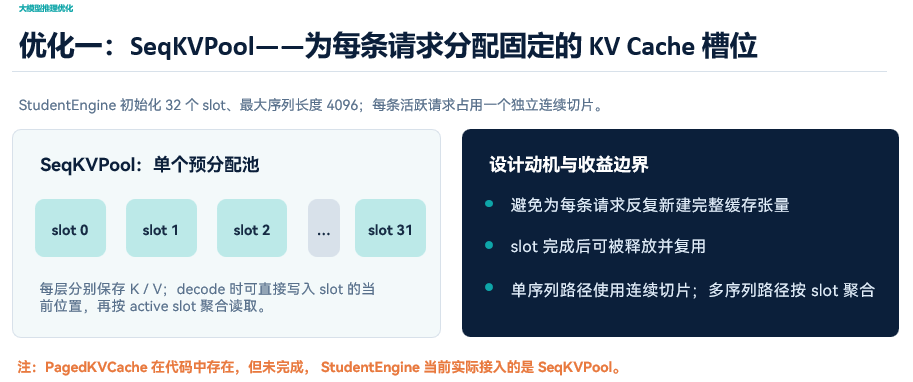
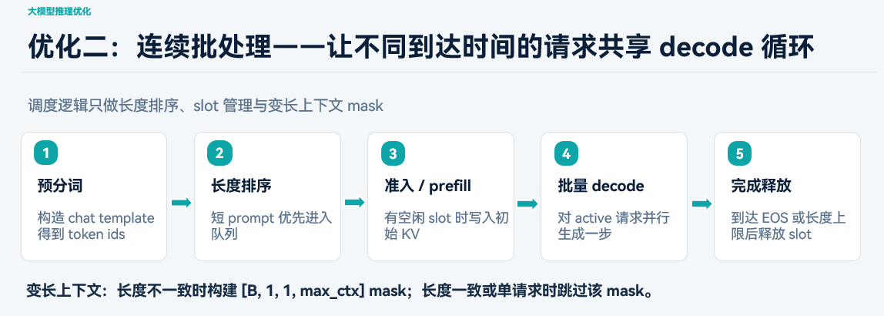
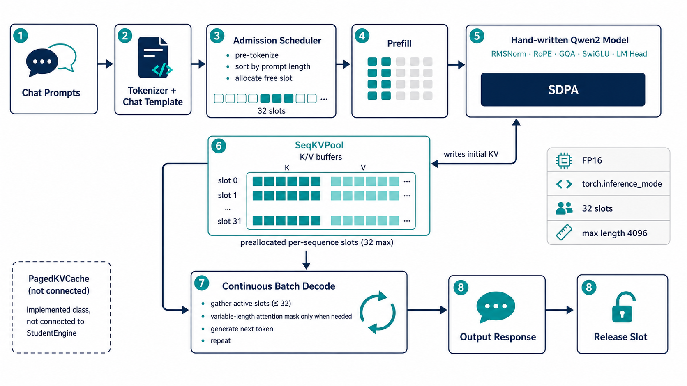
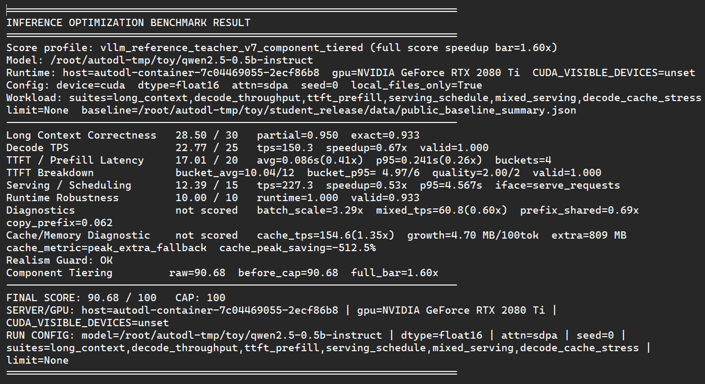
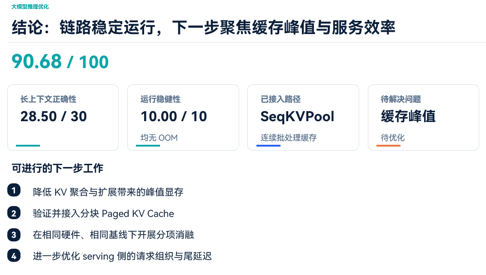

# Qwen2.5-0.5B-Instruct 手写推理引擎项目说明

## 项目简介

本项目基于 Qwen2.5-0.5B-Instruct 的本地权重与配置，完成了一个不依赖 Hugging Face 现成生成接口的手写推理引擎实现。项目的目标是：

- 通过 PyTorch 从零实现模型前向传播逻辑；
- 实现 Prefill / Decode 两阶段生成流程；
- 构建高效的 KV Cache 机制，减少重复计算；
- 支持批量生成与请求级调度接口；
- 为后续推理性能优化、缓存复用与 serving 场景打下基础。

项目来自于`ECNU 2026 DaSESS Ai与数据工程 暑期学校`。

---

## 我们完成的工作

### 1. 实现了自定义的推理入口

在 [student_engine.py](student_engine.py) 中，定义了完整的 `StudentEngine` 接口，负责：

- 加载本地模型配置和 safetensors 权重；
- 初始化 tokenizer，并完成 chat template 的文本格式化；
- 执行 prompt 的批量编码与生成；
- 提供 `generate()` 接口，返回连续生成结果。

这一部分使项目能够直接接入 benchmark 测试脚本，并保持与题目要求一致的接口规范。

### 2. 自定义实现了模型核心模块

在 [workspace/model_layers.py](workspace/model_layers.py) 中，手写实现了 Qwen2 风格模型的关键模块，包括：

- Embedding 层；
- RMSNorm 层；
- RoPE 旋转位置编码；
- GQA（Grouped Query Attention）注意力机制；
- SwiGLU MLP 层；
- LM Head 输出层；
- Transformer block 与完整 causal LM 模型结构。

通过这一套自定义模块，项目不再依赖 `AutoModelForCausalLM` 或其他预置模型 forward 接口。

### 3. 构建了 KV Cache 推理路径

在 [workspace/kv_cache.py](workspace/kv_cache.py) 中，设计并实现了一个可复用的 KV Cache 管理结构，用于在生成过程中保存历史 Key/Value 状态，避免重复计算前序 token 的注意力内容。

主要特点包括：

- 预分配缓存空间，避免频繁创建新张量；
- 支持按层写入和按序列长度读取；
- 提供 `append()`、`keys_values()` 和 `advance()` 等接口；
- 为 decode 阶段提供了更高效的缓存访问路径。

### 4. 优化了生成流程与批处理逻辑

在生成阶段，项目将推理过程拆分为：

- Prefill：对输入 prompt 进行一次前向计算并构建初始缓存；
- Decode：按 token 逐步生成后续内容，并持续更新 KV Cache。

同时，项目支持对多个 prompt 进行批量处理，减少单条生成时的额外开销，并在 [student_engine.py](student_engine.py) 中实现了统一的生成调度逻辑。

### 5. 支持请求级调度接口

为了适配 serving / scheduling 相关测试场景，项目还提供了可扩展的请求调度能力：

- [workspace/scheduler.py](workspace/scheduler.py)：实现了基础的请求排序与批次分组；
- [workspace/paged_kv_cache.py](workspace/paged_kv_cache.py)：提供了 block-based 的分页缓存结构；
- [workspace/prefix_cache.py](workspace/prefix_cache.py)：为共享前缀复用提供了基础缓存能力。

这些模块为后续进一步做 continuous batching、prefix reuse 和更细粒度的 serving 优化预留了扩展接口。

---

## 项目结构说明

- [student_engine.py](student_engine.py)：推理引擎主入口，负责模型加载、生成流程与接口封装。
- [workspace/model_layers.py](workspace/model_layers.py)：自定义 transformer 模块实现。
- [workspace/kv_cache.py](workspace/kv_cache.py)：基础 KV Cache 实现。
- [workspace/scheduler.py](workspace/scheduler.py)：请求调度与批处理组织。
- [workspace/paged_kv_cache.py](workspace/paged_kv_cache.py)：分页 KV Cache 相关实现。
- [workspace/prefix_cache.py](workspace/prefix_cache.py)：共享前缀缓存实现。
#### 技术特点
- 完全基于 PyTorch 自定义实现，不依赖现成生成接口；
- 支持局部模型权重加载与推理；
- 具备基础的 KV Cache 和 GQA Attention 支持；
- 具备 prompt 批量生成、decode 迭代与请求调度能力；
- 兼容 benchmark 任务的输入输出格式。

---

## 当前状态 与 后续优化方向

当前项目已经具备一个可运行的手写推理引擎雏形，能够完成基本的模型加载、token 生成与批量推理流程。它不仅是一个教学与练习型实现，也为后续做推理性能优化、缓存策略优化以及高并发 serving 场景提供了良好的工程基础。

后续可以继续从以下几个方向推进：

1. 进一步优化 attention 的 mask 与 SDPA 路径（PagedKVCache）；
2. 提升 decode loop 的效率，减少额外张量操作；
3. 完善 prefix reuse 与 shared cache 的调度策略；
4. 在 serving 场景下继续提升吞吐与尾延迟表现；
5. 结合 benchmark 结果进行针对性的性能调优。

---

## 参考的材料

关于KV cache的处理

> [SnapKV: LLMKnowsWhatYouareLooking for Before Generation-Li,Huang](../SnapKV.pdf)

关于估算LLM推理和训练所需的GPU内存，有一篇不知道作者是谁的文章，来自于网络，如果作者看到了请联系我冠名↓

> [t估算 LLM 推理和训练所需的 GPU 内存](../估算LLM推理和训练所需的GPU内存_1724990055.pdf)

