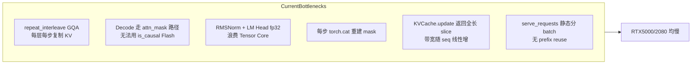
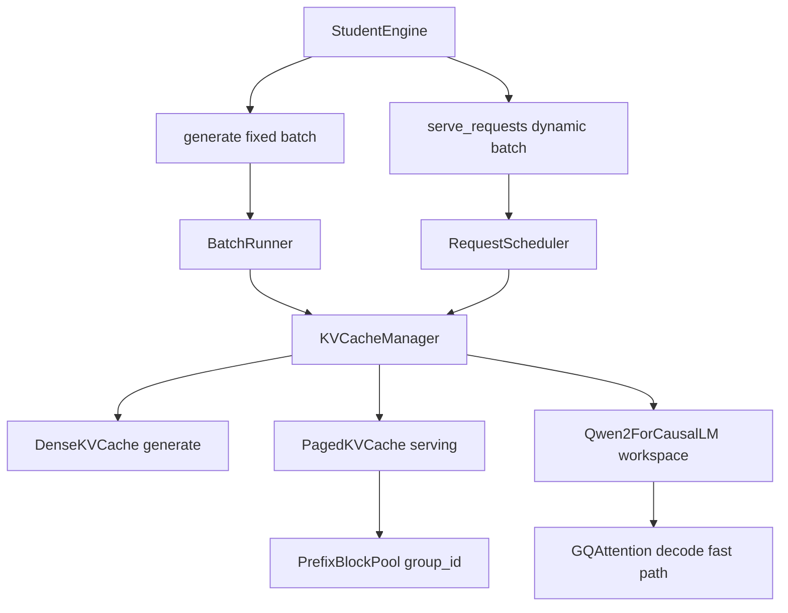

# StudentEngine KV Cache 优先优化计划

## 0. 硬性约束（实现 AI 必须首先遵守）

| 类别 | 要求 |
|------|------|
| **可改文件** | 仅 [`student_engine.py`](student_engine.py) 与 [`workspace/`](workspace/) 下代码；可新增 `workspace/paged_kv_cache.py`、`workspace/scheduler.py` 等 |
| **禁止修改** | `scripts/`、`utils/`、`data/`、`requirements.txt` 等其余代码 |
| **禁止 API** | `AutoModelForCausalLM`、`model.generate`、`model.forward`、vLLM/llama.cpp/TGI 等 |
| **允许 API** | `AutoTokenizer`、`config.json`、`*.safetensors`、`torch` 基础算子、`F.scaled_dot_product_attention` |
| **接口契约** | `generate()` 返回与 `prompts` 等长的 continuation（不含 prompt）；greedy `argmax`；不可根据 `suite_name`/case id/关键词分支 |
| **静态扫描** | 根目录及 `workspace/` 下所有 `.py` 会被 [`scripts/validate_engine.py`](scripts/validate_engine.py) 扫描；禁止出现 `hidden_`、`serving_schedule`、`decode_throughput` 等 benchmark 字符串字面量；禁止读取 `suite_name` 做分支 |
| **正确性门槛** | `long_context_partial_score < 0.30` 总分封顶 50；`< 0.50` 封顶 70；`runtime_success_rate < 0.80` 封顶 70 |

**评分目标（RTX 2080 Ti fp16 baseline，来自 [`data/public_baseline_summary.json`](data/public_baseline_summary.json)）：**

- Decode TPS（bs=4 最优）：**224.8 tok/s**
- TTFT avg / p95：**35.4 ms / 63.0 ms**
- Serving TPS：**425.9 tok/s**
- Long context TPS：**44.7 tok/s**（正确性 30 分，不可牺牲）
- Cache stress TPS：**148.0 tok/s**

---

## 1. 现状诊断：为何 RTX 5000 上“巨慢”

当前实现是**功能正确但算子路径低效**的朴素引擎。主要瓶颈按影响排序：



关键代码位置：

- [`workspace/kv_cache.py`](workspace/kv_cache.py) L29-38：`update()` 每次返回 `[:, :, :end, :]` 全长视图
- [`workspace/model_layers.py`](workspace/model_layers.py) L146-152：每层 `repeat_interleave` 扩展 GQA；decode 强制 `attn_mask` 路径
- [`workspace/model_layers.py`](workspace/model_layers.py) L42-45, L237-241：RMSNorm 与 LM head 全 fp32
- [`student_engine.py`](student_engine.py) L155-163：batched decode 每步 `torch.cat` + 重建 mask

---

## 2. 总体架构目标



**设计原则：**
- `generate()` 走 **DenseKVCache**（简单、低 bug 面，满足 fixed batch decode/TTFT/long_context）
- `serve_requests()` 走 **PagedKVCache + PrefixBlockPool**（shared prefix、continuous batching）
- 两层共用同一套 `GQAttention` decode fast path

---

## 3. 分阶段实施（KV Cache 第一优先级）

### Phase 1 — KV Cache 核心重构（最高优先级，预计贡献 40-60% decode 提升）

**文件：** [`workspace/kv_cache.py`](workspace/kv_cache.py)、[`workspace/model_layers.py`](workspace/model_layers.py)

#### 1.1 重构 `KVCache` API

将“写入”和“读取”分离，避免语义混乱：

```python
class KVCache:
    def __init__(...):
        # 用 torch.empty 替代 torch.zeros（仅写入已用区间，不影响正确性）
        self.k = torch.empty(shape, device=device, dtype=dtype)
        self.v = torch.empty(shape, device=device, dtype=dtype)
        self.seq_len = 0

    def append(self, layer_idx, k_new, v_new) -> None:
        """仅写入 [seq_len : seq_len+S] 区间，不返回值"""

    def keys_values(self, layer_idx) -> tuple[Tensor, Tensor]:
        """返回当前 layer 的 view: [:, :, :seq_len, :] — 零拷贝"""

    def advance(self, n: int) -> None:
        self.seq_len += n
```

**注意：** `Qwen2Model.forward` 目前在所有 layer 跑完后才 `advance()`（L212-213），layer 内 `seq_len` 必须一致；`append()` 使用当前 `seq_len` 作为 write offset，`keys_values()` 读 `:seq_len`（prefill 时 write 后 seq_len 尚未 advance，读到的 end 不含本次写入——需保持与现有语义一致：write 用 `start=seq_len`，read 用 `end=seq_len+new_len`，或在 layer 0 前 advance 逻辑不变）。

**推荐实现：** 保持“整步 forward 结束后 advance”语义，layer 内用局部 `write_pos = cache.seq_len`，读时用 `write_pos + new_len` 作为 attention 有效长度。

#### 1.2 GQA Decode 去掉 `repeat_interleave`（关键）

在 `GQAttention.forward` 中分三条路径：

| 路径 | 条件 | 做法 |
|------|------|------|
| Prefill 无 padding | `is_prefill and attn_mask is None` | 保持 `SDPA(..., is_causal=True)` |
| Prefill 有 padding | `is_prefill and attn_mask is not None` | 一次性构建 additive mask（见 Phase 2） |
| **Decode** | `not is_prefill` (S=1) | **禁止 repeat_interleave**；用手动 GQA matmul 或 SDPA `enable_gqa=True`（PyTorch 2.4+） |

Decode 手动 GQA 伪代码（不依赖 expand 复制）：

```python
# q: [B, H, 1, D], k/v: [B, kv_heads, T, D]
qh = q.view(B, kv_heads, kv_groups, 1, D)
scores = (qh * k.unsqueeze(2)).sum(-1) / sqrt_d   # [B, kv_heads, kv_groups, T]
scores = scores.view(B, H, T)
if attn_bias is not None: scores = scores + attn_bias
w = softmax(scores, dim=-1)
out = einsum("bhlt,bhld->bhld", w, v.repeat_interleave(...))  # 仅对 v 做轻量 broadcast，或 reshape v
```

更优：使用 `F.scaled_dot_product_attention(q, k, v, enable_gqa=True)`（若服务器 PyTorch 支持），直接传入未 expand 的 k/v。

#### 1.3 Decode 专用：去掉全序列 `attn_mask` tensor

Decode 时 Q 只有 1 个 token，causal 已天然满足；**padding 只需屏蔽“KV 中 pad 位置”**，不必构建 `[B,1,1,T]` 大 mask：

- 维护 `kv_valid_len[B]`（真实 token 数，不含 left pad）
- Attention 只对 `k[:, :, :kv_valid_len[i], :]` 做 slice（per-batch 可用 loop + bmm，bs≤8 可接受；或统一 pad 到 batch max valid len）
- 当 batch 内 **无 left padding**（decode_throughput 常见）时，`attn_mask=None`，走最快路径

#### 1.4 预分配 KV，按实际需求 sizing

当前：`total_len = prefill_len + max_new_tokens`，对 padding 浪费严重。

优化：
- 按 `actual_lengths.max() + max_new_tokens` 分配（非 padded 区域）
- 对 batched left-pad：仍按 `prefill_len + max_new_tokens` 分配，但 decode 用 valid_len 限制 attention 范围

---

### Phase 2 — Attention / SDPA 内核与 Mask 优化（预计 15-25% 提升）

**文件：** [`student_engine.py`](student_engine.py) `__init__`，[`workspace/model_layers.py`](workspace/model_layers.py)

#### 2.1 启用 SDPA 后端（在 `StudentEngine.__init__` 末尾）

```python
if device.type == "cuda":
    torch.backends.cuda.enable_flash_sdp(True)
    torch.backends.cuda.enable_mem_efficient_sdp(True)
    torch.backends.cuda.enable_math_sdp(True)  # fallback
```

读取 `attn_implementation` 参数：若为 `"sdpa"` 则上述配置；保留扩展点但不引入 forbidden API。

#### 2.2 Prefill mask 一次性构建 + 复用 buffer

在 [`student_engine.py`](student_engine.py)：
- `_build_prefill_mask` 改为写入预分配 buffer，避免每步 `torch.tensor(0.0/-inf)` 临时张量
- Batched prefill：构建 `[B, 1, S, S]` additive mask 一次，prefill 全程复用

#### 2.3 Decode mask 增量更新

替换 L155-163 的每步 `torch.cat`：
- 预分配 `[B, 1, 1, max_total_len]` mask buffer
- 每步仅向有效区写入 `0.0`（新 token 永远 valid）
- 或 Phase 1.3 所述直接废弃 decode mask

#### 2.4 精度路径（谨慎）

- **Prefill / Long context：** RMSNorm、LM head 可暂保留 fp32（保证 RoPE/长上下文数值稳定）
- **Decode loop：** 在 long_context 回归通过后，尝试 RMSNorm fp16 + LM head fp16/bf16；若 long_context 下降则回退

---

### Phase 3 — Paged KV Cache + Prefix Reuse（Serving 核心，预计 serving 3-10x）

**新增文件：** `workspace/paged_kv_cache.py`、`workspace/prefix_cache.py`（可选合并）

#### 3.1 Block-based Paged KV

参考 vLLM 思路（手写，不引 vLLM）：

```python
BLOCK_SIZE = 16  # 或 32，需与 GPU 友好对齐

class PagedKVCache:
    # 物理池: [num_layers, num_blocks, num_kv_heads, BLOCK_SIZE, head_dim]
    # 逻辑表: request -> list[block_id]
    # block 分配/释放 free list
```

每层 attention：
- 根据 logical blocks  gather K/V（可实现为 block 连续存储 + block_table 索引，避免 Python 循环过多）
- Decode 每步若跨 block 边界则分配新 block

#### 3.2 Prefix Block Pool（shared_prefix 优化）

针对 `group_id` / 相同 token 前缀（benchmark 中 `shared_prefix_id` 如 `SGPT-PUBLIC-SERVEBASE-SHARED`）：

1. Tokenize prompt，找 **最长公共前缀 token 序列**（同 group 内）
2. 对该前缀做一次 prefill，将 resulting KV blocks 放入 `PrefixBlockPool`（key = hash(prefix_token_ids)）
3. 各 request 仅 prefill **suffix 差异部分**，logical block table 头部 link 到 shared blocks（引用计数）

**禁止：** 硬编码 prefix 文本或 case id；必须运行时比较 token ids。

#### 3.3 内存与 OOM 防护

- 设置 `max_blocks` 上限，满则拒绝新 request 或 evict 已完成 request 的 blocks
- 监控 `peak_extra_allocated_mb`（baseline ~263 MB）；block 池大小应控制在 2080 11GB 可用显存内

---

### Phase 4 — `serve_requests` 连续批调度（Serving 15 分）

**新增文件：** `workspace/scheduler.py`  
**修改：** [`student_engine.py`](student_engine.py) `serve_requests`

#### 4.1 请求状态机

```python
@dataclass
class ReqState:
    request_id: str
    input_ids: Tensor       # 已 tokenize
    prefix_len: int
    generated: list[int]
    max_new_tokens: int
    ignore_eos: bool
    finished: bool
    block_table: list[int]  # paged KV
```

#### 4.2 Continuous batching 主循环

```
while active_requests:
    1. 收集所有 unfinished request
    2. 组 batch（限制 max_batch_size，默认 8-16）
    3. 一步 decode forward（共享 PagedKV + GQA fast path）
    4. 更新 generated；达到 max_new_tokens 或 (not ignore_eos and eos) 则 finish
    5. 释放 finished request 的 blocks
返回 [{"request_id": ..., "output": decode_text}, ...] 保持原顺序
```

#### 4.3 调度启发式（不依赖 benchmark 字符串）

- 首波：按 `arrival_time_ms` 排序就绪 request
- 优先组 **同 group_id + 同 prefix hash** 的请求一起 prefill（prefix reuse）
- 长度相近的请求组 batch（提高 GPU 利用率，降低 padding 浪费）
- 支持 per-request `ignore_eos`（benchmark 默认 True）

#### 4.4 `generate()` 保持简单

`generate()` 继续用 DenseKVCache + 固定 batch_size 循环；**不要**在 `generate()` 里做复杂调度（避免影响 decode_throughput/ttft 稳定性）。

---

### Phase 5 — Prefill / TTFT 优化（20 分）

**文件：** [`student_engine.py`](student_engine.py)

| 优化项 | 做法 |
|--------|------|
| Tokenize | 批量 `apply_chat_template` + 一次 `tokenizer(..., padding=True)` |
| TTFT 路径 | `max_new_tokens=1` 时跳过完整 decode loop 基础设施（仍须正确写 KV） |
| RoPE | decode 步只索引单个 position；可 cache `cos/sin[position]` 减少 indexing |
| 长 prefill | 可选 chunked prefill（如 chunk=512）降低 peak activation；**long_context 必须通过** |
| Prefix reuse | serving 中做；`generate()` 的 multi-prompt batch 若前缀相同也可 opportunistic reuse |

---

### Phase 6 — 引擎级微优化与可选加速

**文件：** [`student_engine.py`](student_engine.py)

- `@torch.inference_mode()` 已有；确保无多余 `item()`/`.cpu()` 同步
- 可选：`torch.compile(GQAttention.forward)` 或 whole block（先 correctness 后 compile）
- 可选：CUDA Graph 仅包 decode 单步（batch size 固定时有效；serving 动态 batch 慎用）
- Greedy `argmax`：保持全 vocab（151936）；暂不采样

---

## 4. 文件级改动清单（交给实现 AI）

| 文件 | 动作 | 主要内容 |
|------|------|----------|
| [`workspace/kv_cache.py`](workspace/kv_cache.py) | **重写/扩展** | `append`/`keys_values` API；`empty` 分配；可选 `BatchedKVCache` 带 `valid_len` |
| [`workspace/paged_kv_cache.py`](workspace/paged_kv_cache.py) | **新增** | Block pool、logical block table、alloc/free |
| [`workspace/prefix_cache.py`](workspace/prefix_cache.py) | **新增** | Prefix token hash → shared block chain |
| [`workspace/scheduler.py`](workspace/scheduler.py) | **新增** | ReqState、continuous batching loop |
| [`workspace/model_layers.py`](workspace/model_layers.py) | **修改** | GQA decode fast path；KV API 适配；可选 fp16 decode norm |
| [`student_engine.py`](student_engine.py) | **修改** | SDPA backend；mask buffer；`_generate_batch` 适配新 cache；`serve_requests` 接入 scheduler |

**`student_engine.py` 中 `_generate_batch` 目标结构：**

```python
cache = KVCache(...)
# prefill
logits = self.model(..., is_prefill=True)
# decode loop — 无每步 cat/mask rebuild
for step in range(1, max_new_tokens):
    logits = self.model(next_token, next_pos, cache, attn_mask=None, is_prefill=False)
    next_token = logits.argmax(-1, keepdim=True)
    next_pos += 1
```

---

## 5. 正确性保护（不可跳过）

1. **Long context 回归优先：** 每完成 Phase 1-2 后跑 `long_context` suite；RoPE position、`actual_lengths` left-padding、GQA head 对齐必须验证
2. **Greedy 一致性：** 与当前引擎输出对比（同 seed=0），短 prompt smoke test 应 bit-exact 或仅 fp16 微小差异
3. **Left padding：** Qwen chat template + `padding_side=left`；`position_ids = cumsum(mask)-1` 逻辑不可改
4. **LM head tied weights：** 无 `lm_head` 权重时 `tie_weights()` 逻辑保留
5. **静态检查：** 实现后运行 `python3 scripts/validate_engine.py --skip-load`

---

## 6. 验证与迭代流程（2080 最终目标）

按顺序运行（模型路径以 README 为准）：

```bash
# 1. 静态合规
python3 scripts/validate_engine.py --skip-load

# 2. Smoke
python3 -u scripts/run_inference_benchmark.py \
  --model D:\local_model\qwen2.5-0.5b-instruct \
  --local-files-only --device cuda --dtype float16 \
  --limit 1 --decode-batch-sizes 1 --ttft-batch-sizes 1 \
  --serving-fallback-batch-size 1 --baseline-summary data/public_baseline_summary.json \
  --allow-stale-baseline --output-dir results/smoke_test

# 3. 分 suite 诊断
# long_context → decode_throughput (bs 1,2,4) → ttft_prefill → serving_schedule → decode_cache_stress

# 4. 正式复测
python3 -u scripts/run_inference_benchmark.py \
  --model D:\local_model\qwen2.5-0.5b-instruct \
  --local-files-only --device cuda --dtype float16 \
  --attn-implementation sdpa --baseline-summary data/public_baseline_summary.json \
  --timed-repeats 3 --suite-isolation process \
  --output-dir results/final_eval
```

**分阶段验收指标（相对 baseline 倍率）：**

| 阶段 | 重点指标 | 最低目标 |
|------|----------|----------|
| Phase 1 完成 | decode bs=4 TPS | ≥ 0.50x (112 tok/s) |
| Phase 1+2 | decode bs=4 TPS | ≥ 0.85x (191 tok/s) |
| Phase 3+4 | serving TPS | ≥ 0.50x (213 tok/s) |
| 全部完成 | decode / ttft / serving | 分别 ≥ 0.85x / 0.85x / 0.85x |
| 正确性 | long_context accuracy | ≥ 0.90（不低于现网） |

---

## 7. 风险与回退策略

| 风险 | 对策 |
|------|------|
| GQA 手动实现数值偏差 | 先用短 prompt 与旧引擎逐 token 对比；优先试 SDPA `enable_gqa` |
| Paged KV gather 性能差 | 首版 block 设 32；同 group prefix 仍赚 TTFT；逐步优化 indexing |
| fp16 decode 影响 long_context | Decode 与 prefill 分离精度；long_context 失败则 decode 也保持 fp32 norm |
| `torch.compile` 编译慢/不稳定 | 作为 Phase 6 可选项，默认关闭 |
| RTX 5000 与 2080 差异 | 优化方向一致（带宽+kernel）；2080 为最终基准，5000 用于开发调试 |

---

## 8. 实施顺序总结（给实现 AI 的执行 checklist）

1. **Phase 1a** — 重构 `KVCache` API + 适配 `model_layers.py`
2. **Phase 1b** — GQA decode fast path（移除 `repeat_interleave`）
3. **Phase 1c** — Decode 去 mask / valid_len 路径 + 停止每步 `torch.cat`
4. **Phase 2** — SDPA backend + prefill mask buffer + 精度分级
5. **回归** — long_context + decode_throughput bs=4
6. **Phase 3** — PagedKV + PrefixBlockPool
7. **Phase 4** — scheduler + 重写 `serve_requests`
8. **Phase 5** — TTFT/prefill 细节优化
9. **Phase 6** — compile/CUDA graph（可选）
10. **Final** — 2080 全量 benchmark + 静态扫描

**核心原则：KV Cache 与 GQA decode 路径先落地，Serving 的 Paged/Prefix 次之；任何优化不得牺牲 long_context 正确性与 README 合规性。**
